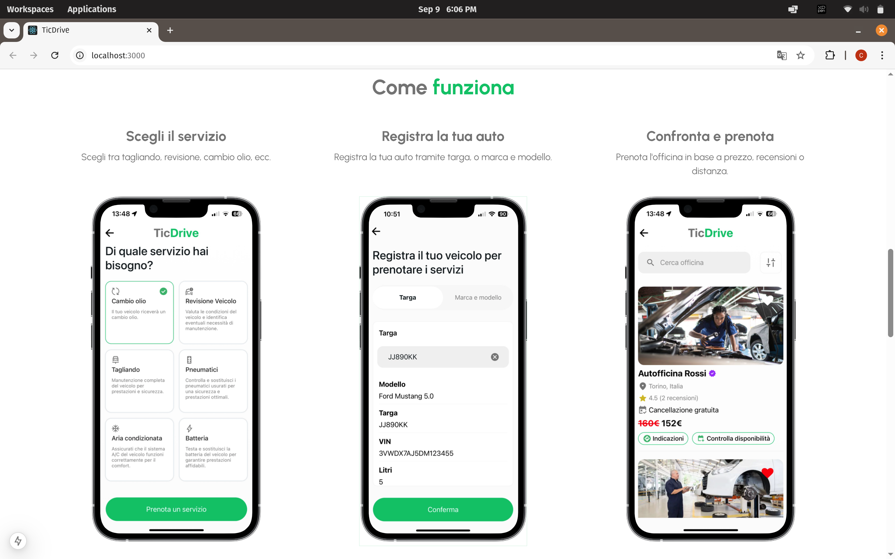

# TicDrive - Landing Page 🚗⚡

A **landing page with backend integration**, created to promote the TicDrive project in the automotive sector.  
The website has been designed to be **clean, professional and responsive**, while also including **lead generation via email backend** and **analytics for marketing campaigns**.  

This landing page was launched in **November 2024** with a **Facebook Ads campaign**, supported by Google Analytics, Meta Pixel, Hotjar and Vercel Analytics for performance and conversion tracking.  

View site [here](https://www.utenti-ticdrive.it).
Download the [IOS](https://apps.apple.com/it/app/ticdrive/id6740627366?l=en-GB) and Android version of TicDrive app.

---

## 📖 Project Overview
- 🌍 **Type**: Landing page + backend (email collection & analytics)  
- 🎯 **Purpose**: Startup launching
- 📅 **Launched**: November 2024 (Facebook Ads campaign)  
- 🏗️ **Developed by**: Andrei Albu 

---

## 🛠️ Tech Stack
The project uses modern frontend + backend technologies:

- **Frontend**:
  - [Next.js](https://nextjs.org/) (React framework)  
  - **TypeScript** for type safety  
  - **CSS3 / [Tailwind](https://tailwindcss.com/) / Custom styles**  
  - **Responsive Design** for mobile/desktop  
- **Backend**:
  - Node.js / Express API for receiving **emails** from landing page forms  
  - Integration with mailing service (contact form submissions)
  - MongoDB for storage
- **Analytics & Marketing**:
  - [Google Analytics](https://analytics.google.com)
  - Meta Pixel (Facebook Ads)  
  - [Hotjar](https://www.hotjar.com) (UX heatmaps & recordings)  
  - Vercel Analytics & Speed Insights  

---

## 🚀 Features
- ✅ **Hero section** with strong CTA  
- ✅ **About & Services** sections explaining TicDrive’s mission  
- ✅ **Call-to-Action** with email form → connected to backend  
- ✅ **Responsive navbar & design**  
- ✅ **Google Analytics + Meta Pixel + Hotjar** tracking  
- ✅ **Launched campaign tested with Facebook Ads (Nov 2024)**  
- ✅ **Performance monitoring** with Vercel Speed Insights  

---

## 📸 Preview

